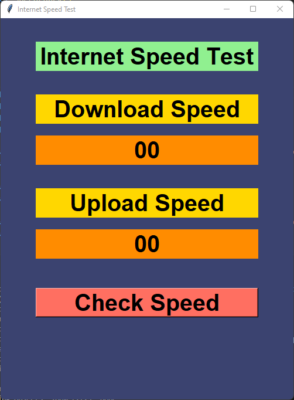
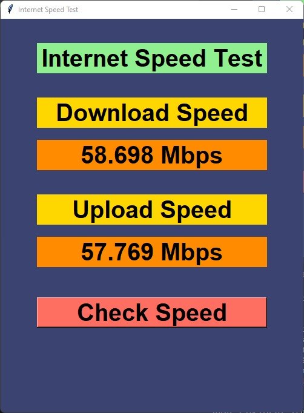

# Internet Speed Test with Python 
# Overview
This Python application provides a simple and user-friendly way to check your Internet connection's speed. It allows you to measure both download and upload speeds with just a click of a button. The application is built using the Tkinter library for the graphical user interface and the  `speedtest` library to perform the actual speed test.

# Features
- **Download Speed:** Check your download speed with just one click.
- **Upload Speed:** Get accurate upload speed measurements.
- **Clear UI:** The application offers a clean and intuitive user interface.
# Screenshot
 

Feel free to use, modify, and share this app as needed.

**Happy coding!**😄

